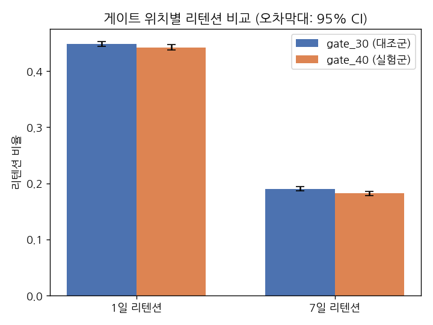
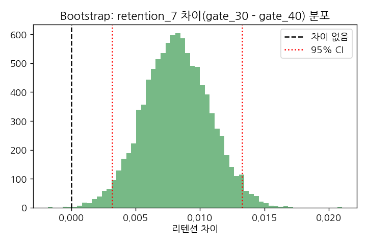
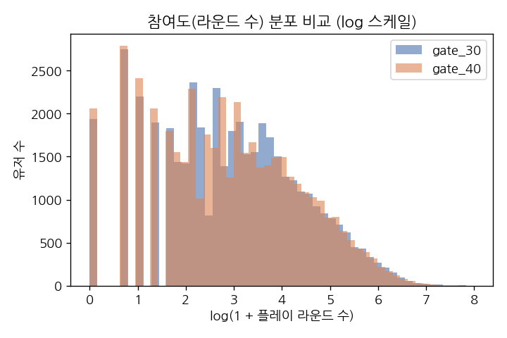

# A/B 테스트 포트폴리오 프로젝트: Cookie Cats 모바일 게임 리텐션 실험

**김태훈 | 2026년 10월**

모바일 퍼즐 게임 Cookie Cats의 실제 A/B 테스트 데이터를 Python으로 분석하여,
"문제정의 → 가설수립 → 실험설계 → 성과측정 → 개선" 사이클을 처음부터 끝까지
직접 수행한 개인 포트폴리오 프로젝트입니다.

---

## 프로젝트 개요

- **데이터셋**: [Mobile Games A/B Testing - Cookie Cats](https://www.kaggle.com/datasets/yufengsui/mobile-games-ab-testing) (Kaggle, 90,189명)
- **사용 도구**: MySQL 8.0 (데이터 적재·집계), Python (pandas, pymysql, scipy, statsmodels, matplotlib — 통계 검정·시각화)
- **비즈니스 질문**: 게임의 첫 번째 진행 게이트(progression gate)를 레벨 30에서
  레벨 40으로 옮기면 유저 리텐션이 개선되는가?
- **목표**: SQL로 대용량 원본 데이터를 적재·집계하고 Python으로 통계적 유의성을
  검정하는 실무형 분업 구조를 직접 재현하여, 가설검정·신뢰구간·부트스트랩·
  비열등성 검정 등 A/B 테스트 분석 역량을 증명하는 개인 프로젝트

## 폴더 구조

```
.
├── README.md
├── requirements.txt
├── data/
│   ├── cookie_cats.csv          원본 데이터셋 (Kaggle)
│   └── cookie_cats_mysql.csv    MySQL 적재용 전처리본 (TRUE/FALSE -> 1/0)
├── sql/
│   ├── schema.sql                테이블 생성 DDL
│   ├── load_data.sql             LOAD DATA INFILE 적재
│   └── queries.sql               5개 집계 쿼리 (설명 포함)
├── scripts/
│   └── prepare_for_mysql.py      적재 전 전처리 스크립트 (Python/pandas)
├── notebooks/
│   ├── analysis.py               jupytext 소스 (버전 관리용)
│   └── analysis.ipynb            실행 결과 포함 전체 분석 노트북
└── images/                       노트북에서 생성된 차트
```

## SQL 데이터 적재 및 집계 (MySQL)

원본 CSV를 MySQL에 적재한 뒤, 통계 검정에 들어가기 전 그룹별 샘플 수·리텐션율·
참여도 요약을 **SQL로 먼저 집계**했습니다. 통계적 유의성 검정(z-test, 부트스트랩
등)은 Python에서 수행하지만, 대용량 원본 데이터에서 분석용 요약 테이블을
뽑아내는 것은 SQL의 역할로 분리했습니다 — 실무에서 데이터 웨어하우스(SQL)와
분석 레이어(Python)가 나뉘어 있는 구조와 동일합니다.

- **전처리 이슈**: 원본 CSV의 `retention_1`/`retention_7`이 TRUE/FALSE 문자열이라
  MySQL TINYINT 컬럼에 바로 적재하면 묵시적 캐스팅으로 전부 0 처리되는 문제가
  있어, `scripts/prepare_for_mysql.py`로 1/0 정수로 먼저 변환한 뒤 적재
- **SQL 집계 결과(발췌)**: 그룹별 샘플 수(gate_30 44,700 / gate_40 45,489),
  리텐션율(1일 44.82%/44.23%, 7일 19.02%/18.20%), 참여도 평균·표준편차,
  이상치 상위 5건, NULL/중복 체크 — 전체 쿼리와 결과는 `sql/queries.sql` 참고
- 노트북(`notebooks/analysis.ipynb`) 4절에서 Python으로 MySQL에 직접 접속(pymysql)해
  같은 집계를 재실행하고, 두 결과가 일치하는지 교차검증합니다.

## 문제정의 → 가설 → 실험설계 → 측정 → 개선 사이클

| 단계 | 수행 내용 |
|---|---|
| **문제정의** | 게이트 위치(레벨 30 vs 40)가 리텐션에 미치는 영향 규명 |
| **가설수립** | H0/H1 설정 + 1차 지표(리텐션)와 가드레일 지표(참여도)를 사전에 구분 |
| **실험설계** | 기존 A/B 배정 구조 검증(SRM 체크), 측정 윈도우(1일/7일) 적절성 평가 |
| **데이터 적재·집계** | MySQL에 적재 후 SQL로 그룹별 샘플 수·리텐션율·참여도 집계 |
| **성과측정** | 2-proportion z-test, 부트스트랩 리샘플링, 비열등성 검정, Mann-Whitney U 검정 (Python) |
| **개선/제안** | 게이트 레벨 30 유지 권고 + 데이터 한계와 후속 분석 과제 제시 |

## 데이터 품질 체크 — 실무형 판단 포인트

실제 공개 데이터셋을 그대로 믿지 않고 분석 전 아래 두 가지를 직접 검증했습니다.

- **SRM(Sample Ratio Mismatch) 체크**: 두 그룹(44,700명 vs 45,489명)의 비율이
  설계대로 50:50에 가까운지 카이제곱 검정으로 확인 → p=0.0086으로 경미한 불균형
  신호 발견. 실무였다면 결론으로 바로 넘어가지 않고 배정 로직·세그먼트 쏠림부터
  점검했을 지점이며, 이 캐비어트를 결과 해석에 명시했습니다.
- **이상치 처리**: 1명의 유저가 49,854라운드(평균의 약 1,000배)를 기록한 극단치
  발견 → 봇/QA 계정으로 추정, 참여도 분석에서 제외하고 그 판단 근거를 기록

## 핵심 분석 결과

| 지표 | gate_30 | gate_40 | 차이(30-40) | p-value | 유의성 |
|---|---|---|---|---|---|
| 1일 리텐션 | 44.82% | 44.23% | +0.59%p | 0.074 | 유의하지 않음 |
| 7일 리텐션 | 19.02% | 18.20% | +0.82%p | **0.0016** | **유의함** |
| 참여도(라운드 수, 가드레일) | 평균 51.3 | 평균 51.3 | - | 0.051 | 경계값(유의하지 않음) |



**해석**: 1일 시점에는 차이가 보이지 않다가 7일 시점에 유의한 격차가 나타나는 것은,
게이트를 늦게 배치해서 생긴 피로·이탈 효과가 단기보다 중장기에 누적된다는 뜻으로
해석할 수 있습니다.

부트스트랩 10,000회 리샘플링으로 교차검증한 결과도 동일한 결론을 뒷받침합니다
(95% CI: 0.32%p ~ 1.33%p, 0을 포함하지 않음).



추가로, "리텐션이 다소 떨어져도 다른 지표가 좋으면 받아들일 수 있는가?"라는
실무 질문에 답하기 위해 **비열등성(Non-Inferiority) 검정**을 마진 0.5%p 기준으로
직접 적용해봤습니다 — 결과는 "비열등하다고 볼 수 없음"으로, 리텐션 하락폭이
허용 마진보다 커서 다른 큰 이득 없이는 gate_40을 정당화하기 어렵다는 결론입니다.

가드레일 지표인 참여도(플레이 라운드 수)는 통계적으로 유의한 차이가 없었습니다
(Mann-Whitney U, p=0.051) — 즉 게이트 위치가 참여도 자체를 크게 해치지는 않지만,
가드레일만 보고 "문제없다"고 결론 내리면 리텐션 손실을 놓치게 됩니다.



## 결론 및 제안

게이트는 **레벨 30에 유지**를 제안합니다. 1일 리텐션에서는 차이가 없었지만 7일
시점에 누적되는 유의한 리텐션 손실이 확인되었고, 이를 상쇄할 만큼 참여도가
개선되지도 않았습니다.

**한계 및 다음 단계**
- SRM 신호가 있었던 만큼, 실제 상황이라면 재실행 전 배정 로직부터 점검
- 측정 기간이 7일까지로 제한적 — 과금 전환, 30일 리텐션 등 장기 지표 확인 필요
- 유저 세그먼트(신규/재설치, 유입 채널) 정보가 없어 이질적 효과 분석은 수행하지 못함

## 실행 방법

```bash
# 1. MySQL에 데이터 적재
mysql -u root < sql/schema.sql
cd scripts && python3 prepare_for_mysql.py && cd ..
# cookie_cats_mysql.csv를 MySQL의 secure_file_priv 폴더로 복사한 뒤:
mysql -u root < sql/load_data.sql

# 2. Python 분석 실행
pip install -r requirements.txt
jupyter nbconvert --to notebook --execute notebooks/analysis.ipynb
```

---

## 이력서/자기소개서/면접 활용 예시

> **A/B 테스트(리텐션 실험) 분석 프로젝트 (개인, 2026)**
> 모바일 게임 A/B 테스트 공개 데이터(9만 건)를 MySQL에 적재·집계하고 Python으로
> 통계적 유의성을 검정해 진행 게이트 위치 변경이 리텐션에 미치는 영향을 검증.
> 2-proportion z-test, 부트스트랩, 비열등성 검정으로 7일 리텐션의 유의한
> 하락(p=0.0016)을 확인하고, SRM 체크·가드레일 지표 설계 등 실무형 실험 검증
> 절차를 직접 수행.

**면접/지원서 질문에 이렇게 쓸 수 있습니다** ("직접 문제정의→가설→실험설계→
성과측정→개선을 수행한 경험을 서술하라" 유형):

1. **문제정의**: 모바일 게임의 과금 유도 장치(게이트) 위치가 유저 이탈에
   영향을 줄 것이라는 가설 하에, "게이트를 레벨 40으로 옮기면 리텐션이
   개선되는가"라는 질문을 설정
2. **가설수립**: 1차 지표(1일/7일 리텐션)와 가드레일 지표(참여도)를 사전에
   구분해 설계 — 리텐션만 보면 참여도 손실을 놓칠 수 있다는 점을 고려
3. **실험설계 검증**: 분석에 들어가기 전 두 그룹 샘플 비율이 설계대로
   배정됐는지(SRM) 먼저 확인 — 경미한 불균형 신호를 발견해 결과 해석에
   캐비어트로 반영
4. **성과측정**: z-test, 부트스트랩, Mann-Whitney U, 비열등성 검정 등
   여러 방법으로 교차검증해 "7일 리텐션이 유의하게 하락한다"는 결론의
   신뢰도를 높임
5. **개선/제안**: 게이트 레벨 30 유지를 권고하고, 측정 기간·세그먼트
   정보 부재 등 분석의 한계와 후속 과제를 투명하게 제시

**정직하게 밝힐 부분**: 이 프로젝트는 실제 사내 실험을 직접 설계·운영한
것이 아니라 공개된 실험 데이터를 가져와 분석·검증한 것입니다. 하지만 실험
설계의 적절성을 검토하고, 여러 통계 기법으로 결과를 교차검증하며, 가드레일
지표와 비열등성 검정까지 적용한 과정 자체는 실무에서 요구하는 분석적 사고와
동일한 방식으로 직접 수행했습니다.
